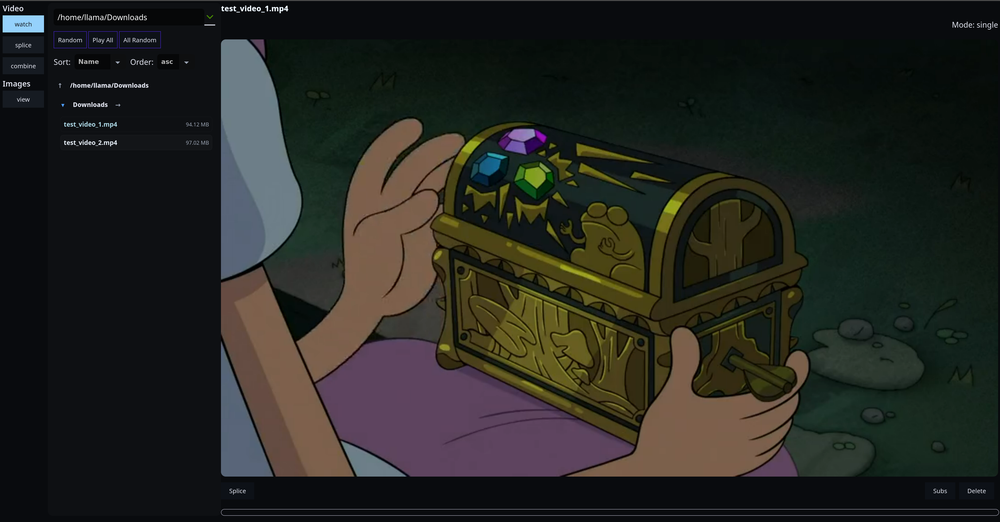
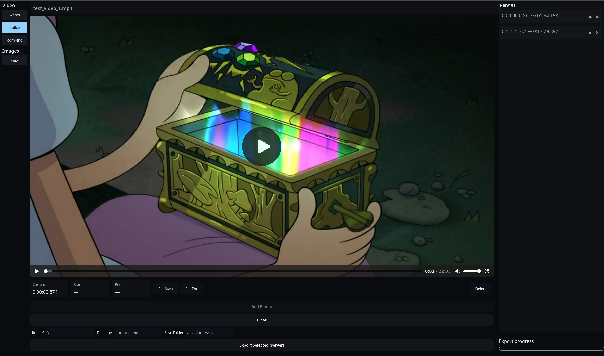
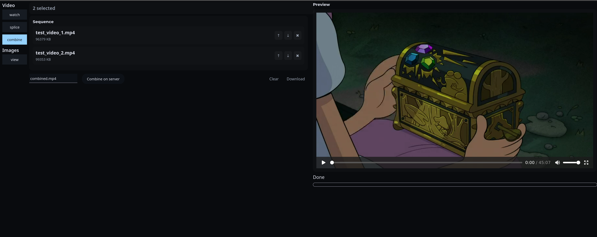

React/Node app for viewing videos and images on your local filesystem, with some utility functions.

- Note: only meant for running locally, not deployed/production servers.
- Note: only tested on Linux, your milage may vary

# Setup
- Prereq: nodejs, npm
- `npm install`
- `npm run start` for backend, port 3001
- `npm run dev` for frontend, port 5173
- copy .env.example to .env if you want opensubtitles download feature (create free account to get API key)

# Screenshots

Watch Video

Splice Video

Combine Videos

View Images

# Features
- Watch video files
  - List all videos in a given folder path
  - Play all in a folder, play all random, or play single random
  - Auto remux to mp4 if not playable in browser
  - Delete video
  - Download subs for a video
- Splice video files
  - Define multiple start/end times
  - Define rotation, output filename, output folder
  - Create new file with defined segments and settings
- Combine video files
  - Open multiple video files and combine into new file
- View images
  - List all images in a given folder path (displays preview images in grid)
  - Select image to view full size and zoom
  - Select random image from folder
  - Crop image

# License
MIT