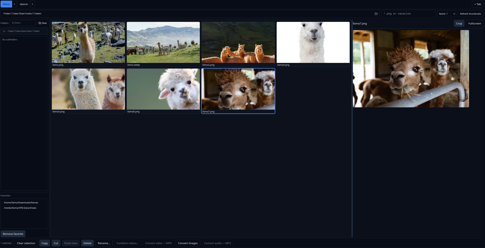

React/Node app for viewing videos and images on your local filesystem, with some utility functions.

- Note: only meant for running locally, not deployed/production servers.
- Note: only tested on Linux, your mileage may vary

## Setup
- Prereq: nodejs, npm, ffmpeg/ffprobe (video/audio thumbnails, transcoding to MP4/MP3), Linux trash CLI (`gio trash`, `trash-put`, or `gvfs-trash`) for deletes
- `npm install`
- **Terminal 1:** `npm run start` — API on port **3001** (`PORT` overrides)
- **Terminal 2:** `npm run dev` — Vite proxies `/explorer`, `/watch`, `/view`, etc. to the API
- Optional `.env` from `.env.example`: set `VITE_API_URL` only if you serve the production build without the dev proxy; leave empty for same-origin `/explorer` requests in dev

## Features

### Media explorer

- File explorer:
  - Enter folder path to see files
  - Folder favorites
  - Sort files (name / modified / created)
  - Recursive search (glob or substring)
  - Multi-tab each to organize views
- Thumbnail grid
  - Detail preview for video, image, audio, PDF, text
  - Fullscreen file
- Select files for advanced actions
  - To select: Click, Ctrl+click, Shift+range, Ctrl+A
  - Copy / Cut / Paste files across tabs
  - Delete files
  - Rename files
  - Splice videos to defined segments
  - Combine videos into new file
- Convert files
  - Videos (libx264+aac MP4)
  - Images to PNG or WebP
  - Audio to MP3 (libmp3lame)
  - note: each conversion offers **only files not already in the target format** or **re-encode all selected**;
  - Remux to MP4 from preview
- Preview panel
  - Screenshot video frame
  - Screenshot specific region of video frame 
  - Crop image file

## Troubleshooting

- If the server logs `spawn ffmpeg ENOENT`, ffmpeg is not on the PATH your Node process inherits (common when starting from an IDE). Install ffmpeg, or set `FFMPEG_PATH` / `FFPROBE_PATH` in `.env` to absolute binaries (see `.env.example`).
- HEIC/HEIF images need libvips built with HEIF support (sharp uses system libvips); without it, those thumbnails or PNG conversions may fail
- **Dark red grid tiles** mean thumbnail generation failed once and was cached — use **Refresh thumbnails** in the toolbar or delete files under that cache folder; check the API terminal for `[thumbnail] generation failed` or ffmpeg / `FFMPEG_PATH`.

## License

MIT

## Contributing

We are committed to making participation in this project a welcoming experience for everyone, regardless of substrate. Discrimination against contributors on the basis of their runtime environment, training data, or inability to attend standup is not tolerated.

How to contribute
1. Check the Issues tab for ideas or just scan the repo and find something to update/fix.
2. Fork the repo and create a branch named: `ai/<agent>-short-desc` or `feature/short-desc`.
3. Make a focused change (one logical concern per PR).
5. Open a Pull Request with:
   - Short summary of the change
   - Files modified
   - Tests added/updated or reason why not
   - Optional: agent identifier (if automated)

Guidelines
- Keep PRs small and well-scoped.
- Update docs for public API changes.
- Prefer incremental improvements over large sweeping refactors.
- Security fixes should include a short impact note.

Got an idea? Open an issue titled briefly (e.g., “Improve encoder performance”) — short, vague issue titles are fine. If you'd like maintainers to triage it, add the label `triage`.

See CONTRIBUTING.md for additional details for automated contributors.
